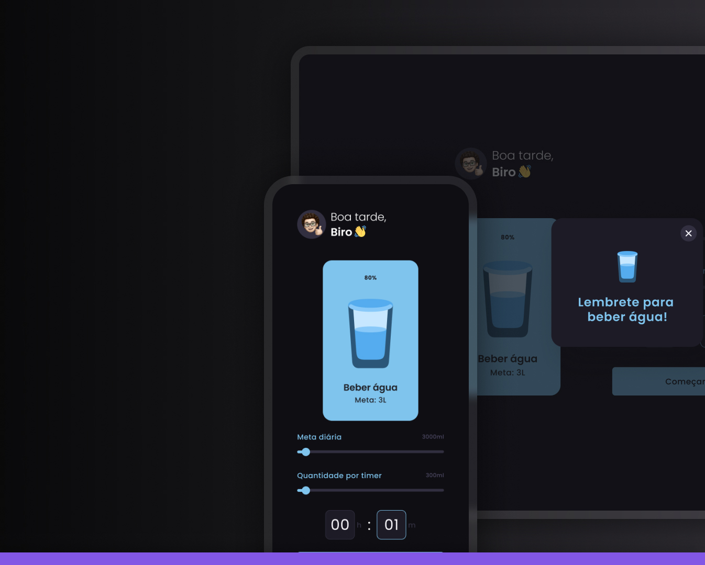

<h1 align="center"> Reminder </h1>

  <a href="#-tecnologias">Tecnologias</a>&nbsp;&nbsp;&nbsp;|&nbsp;&nbsp;&nbsp;
  <a href="#-projeto">Projeto</a>&nbsp;&nbsp;&nbsp;|&nbsp;&nbsp;&nbsp;
  <a href="#-layout">Layout</a>&nbsp;&nbsp;&nbsp;|&nbsp;&nbsp;&nbsp;
  <a href="#memo-licença">Licença</a>

## 🚀 Tecnologias

Esse projeto foi desenvolvido com as seguintes tecnologias:

- ReactJS
- NextJS
- TailwindCSS
- Git e Github
- Figma

## 💻 Projeto

Um reminder para beber.

- [Acesse o projeto finalizado, online](https://reminder-gray.vercel.app/)

## 🔖 Layout

Você pode visualizar o layout do projeto através [DESSE LINK](https://www.figma.com/community/file/1278710249415753889/Reminder-Beber-%C3%81gua-%E2%80%A2-Desafio-35). É necessário ter conta no [Figma](https://figma.com) para acessá-lo.

## 📝 Licença

Esse projeto está sob a licença MIT.

## Team

Este projeto foi desenvolvido pela(s) seguinte(s) pessoa(s) [Jefferson Silva](https://www.linkedin.com/in/jeffsilva01/) e o layout feito com ♥ by [Rocketseat](https://www.rocketseat.com.br/)
